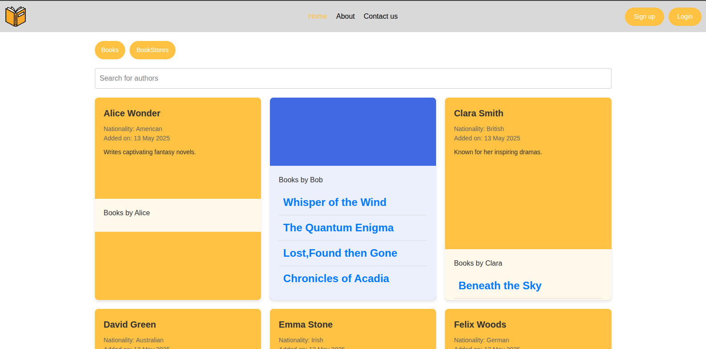
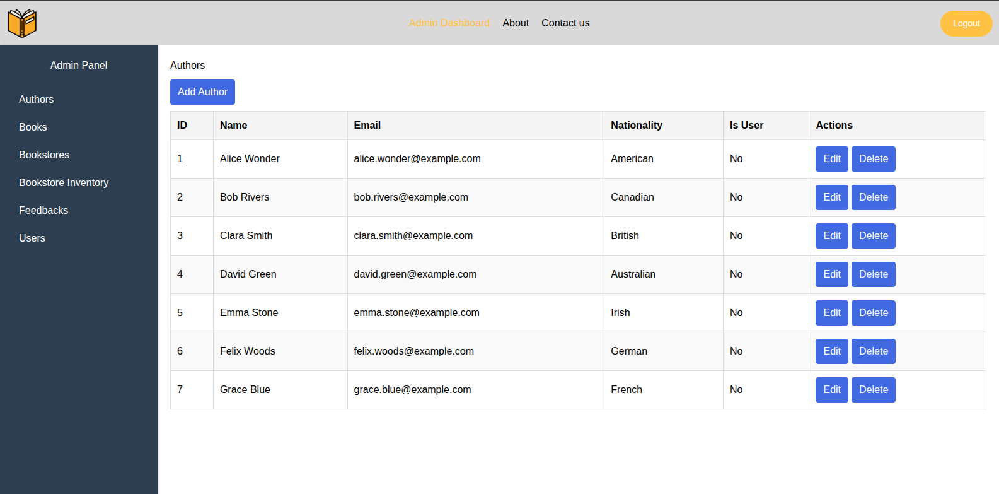

#  WebBookstore

## Table  Of Contents
1. [__Introduction__](Introduction)

2. [__Features__](Features)

3. [__Technologies Used__](Tech-used)

5. [__Screenshots__](Screen)

    1. __Home Page__

    2. __Authors Panel__

    3. __Bookstore Management__

    4. __Admin Panel__

6. [__Installation__](Install)

7. [__Future Enhancements__](cls)

8. [__Contributions & Licenses__](cls)

9. [__links__](cls)

# Introduction 🌟

The WebBookstore Project is a web application that is full-stack and deals with bookstore, books, authors, and users. It has an intuitive admin panel to manage inventory, book bookstores with books, and user roles. The application also deals with user authentication (register, login) and role-based access (e.g., admin or user).

Explore not only the wonders of reading books but being able write your own and be an Amazing  __Author__. 

This project will be appropriate for small to medium-sized bookstores who wish to streamline their operations and provide a seamless experience for administrators as well as customers.

# Features  💻

## Core Features

- __User Authentication__ : Secure login and registration with JWT tokens.

- __Role-Based Access Control__ : Admins can manage users,bookstores, and books, while regular uses have limited access.

- __Bookstore Management__ : Create , update , and delete bookstores. Assign books to bookstores with stock and prices.

- __Books Inventory__ : Add, edit, and delete books.View detailed information about books and their availability.

- __Author Management__ : Add Authors and associate them with books.

- __Ban/Un-ban__ : Admins can ban or un-ban users from system.

- __Responsive Design__: Clean and modern UI that works on both desktop and mobile devices.

# Technologies Used

## Backend
 - __Flask__ : Lightweight Python framework for building the _API_.

 - __SQLALCHEMY__ : _ORM_ for database management.

 - __JWT(_JSON web tokens_)__ : For secure authentication and authorization.

 - __PostgreSQL__ : Relational database for storing users, books, bookstores and authors. 

## Frontend
- __vite-React.js__ : Javascript library for building the user interface.

- __React Router__ : For navigation between pages. 

- __Axios/Fetch__ : For making API calls to the backend.

- __CSS/SCSS/Tailwind CSS__ : Styling the application.

## Deployment

 > [!NOTE]
 > Not Yet DEPLOYED ! But Soon though.

# 📸 ScreenShots

## Home Page

    

## Author Panel

## Bookstore Management

## Admin Panel

# Installation ⚙️

 > [!NOTE]
 > The following steps are to be followed once this notice is gone so for now BE PATIENT !.

## Prerequisites
- NPM and Node (latest version preffered)

- Vite-React  ⚛️

- TailwindCss and CSS

## Steps

1. Clone the Repository:

        git clone https://github.com/Jeremy-3/Bookstore.git
        cd Bookstore

2. Install Dependencies

        npm install
        npm run dev (to deploy)

# Future Enhancements 🚀 

1. Adding Book Content to allow users to read the books
2. Allow users to like books ad save them to their library

> [!NOTE]
> If you have more Suggestions, Do try and reach out . 

# Contributions 👥

- Fork repository.

- Create a new Branch (`git checkout -b feature/your-feature-name`)

- Commit your changes(`git commit -m 'added some features`)

- Push to the Branch(`git push feature/your-feature-name`)

- Open a Pull Request

# 📄 lisenses

This project is licensed under the MIT License . See the [LICENSE](https://opensource.org/license/mit) file for details.

---

## 🔗 Links

- **Live Demo**: [BookStore Application](bookstore-mocha-iota.vercel.app)
- **Backend Repository**: [Bookstre API](https://github.com/Jeremy-3/Bookstore-backend)

---
